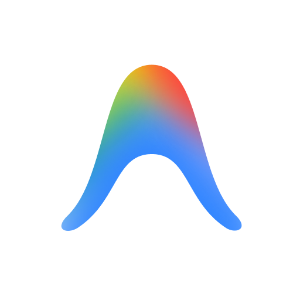

<p align="center">
  
</p>

<h1 align="center">AnityG-Mod</h1>

<p align="center">
  <strong>Custom model support &amp; smart routing for Google Antigravity</strong>
</p>

<p align="center">
  
  
  
  
</p>

---

## 📖 Table of Contents

- [Overview](#-overview)
- [Quick Start](#-quick-start)
- [Adding Models](#-adding-models)
- [Auto Router](#-auto-router)
- [Dashboard](#-dashboard)
- [Manual Build & Development](#-manual-build--development)
- [How It Works](#-how-it-works)
- [Project Structure](#-project-structure)
- [Security & Privacy](#-security--privacy)
- [Contributing](#-contributing)
- [Acknowledgments](#-acknowledgments)

---

## 🔭 Overview

By default, Google Antigravity only connects to Google's internal models. **AnityG-Mod** routes requests through a lightweight local proxy so you can use **OpenAI**, **Anthropic**, **DeepSeek**, **Groq**, local **Ollama** instances, or any custom OpenAI-compatible endpoint - all directly inside the IDE model picker.

This fork builds on `antigravity-add-model` and adds an **Auto (Smart Router)** mode that inspects prompt contents (images, code snippets, context length) and dynamically routes each prompt to the best configured model, with automatic fallback if a provider fails.

---

## 🚀 Quick Start

### Prerequisites

- **Node.js** v18 or later
- **Google Antigravity** (classic app or Antigravity IDE 2.5+)

### Installation

```bash
# Clone the repository
git clone https://github.com/trytotest13/Antigravity-Custom-Model-AnityG-Mod.git
cd AnityG-Mod

# Run the installer (Windows)
install.bat
```

The installer will:

1. Detect your Antigravity installation (classic or IDE 2.5+).
2. Install dependencies and build the TypeScript source.
3. Back up original files (`app.asar.backup` / `.bak`).
4. Apply the patch and restart the IDE.

> **💡 After IDE updates:** Antigravity updates overwrite patched files. Simply run `install.bat` again after any update.

### Uninstalling

```bash
uninstall.bat
```

---

## ➕ Adding Models

| Installation Type | How to Add |
|---|---|
| **Classic App** | Open **Settings → Add Model** in the UI |
| **Antigravity IDE 2.5+** | Edit `%USERPROFILE%\.gemini\antigravity\custom_models.json` |

Once you have at least one custom model configured, **Auto (Smart Router)** automatically appears in the model selector.

---

## 🧠 Auto Router

Selecting **Auto (Smart Router)** routes each prompt dynamically based on its content:

| Capability | Behavior |
|---|---|
| **🖼️ Vision** | Directs requests containing images to vision-capable models |
| **💻 Code** | Routes programming questions and stack traces to your best coding model |
| **📏 Context Size** | Selects models with large context windows for large files or long chats |
| **🔄 Fallbacks** | If a provider hits a rate limit or errors out, retries with the next suitable model |
| **📦 Context Management** | Compresses older history when conversations exceed token limits, preserving recent turns and system prompts |

### Manual Overrides

Force a specific model or capability directly in your prompt:

```
#model:<model-name>       → e.g. #model:deepseek-chat
#:code                    → force routing to coding models
#:vision                  → force routing to vision models
```

---

## 📊 Dashboard

AnityG-Mod includes a built-in dashboard (served by the proxy) for monitoring routing decisions, model health, and request history. Access it via the tray icon or by navigating to the proxy's dashboard endpoint.

---

## 🛠️ Manual Build & Development

```bash
# Install dependencies
npm install

# Build
npm run build

# Deploy (classic Antigravity)
powershell -ExecutionPolicy Bypass -File deploy.ps1

# Deploy (Antigravity IDE 2.5+)
powershell -ExecutionPolicy Bypass -File deploy-ide.ps1
```

### Available Scripts

| Script | Description |
|---|---|
| `npm run build` | Compile TypeScript to `dist/` |
| `npm run dev` | Watch mode - recompile on save |
| `npm test` | Run tests with Vitest |
| `npm run test:watch` | Run tests in watch mode |
| `npm run lint` | Lint source with ESLint |
| `npm run lint:fix` | Auto-fix lint issues |
| `npm run format` | Format source with Prettier |
| `npm run format:check` | Check formatting without writing |

---

## ⚙️ How It Works

Antigravity's language server connects to Google API endpoints. The mod redirects this traffic to a lightweight local proxy (`proxy.ts`, running on port 50999 or the next available port).

The proxy:

1. **Injects** your configured models into the IDE's model list.
2. **Intercepts** generation calls and translates Gemini API request formats to OpenAI, Anthropic, or Ollama formats.
3. **Streams** responses back to the IDE in the format it expects.

When **Auto** is enabled, `autoRouter.ts` parses the incoming payload, scores your configured models based on requirements (vision, context, coding), and routes the request - falling back to the next best model on failure.

---

## 📂 Project Structure

```
AnityG-Mod/
├── src/
│   ├── main.ts                  # Electron main process entry
│   ├── preload.ts               # Preload script (bridge between main & renderer)
│   ├── proxy.ts                 # Local proxy server - request interception & streaming
│   ├── proxy/
│   │   ├── autoRouter.ts        # Smart classification, scoring & fallback routing
│   │   ├── dashboard.ts         # Built-in monitoring dashboard
│   │   ├── modelUtils.ts        # Model capability helpers
│   │   ├── registry.ts          # Model registry & configuration loader
│   │   ├── shared.ts            # Shared proxy types & utilities
│   │   ├── smartHealth.ts       # Provider health tracking
│   │   └── translators/
│   │       ├── anthropic.ts     # Anthropic Claude format adapter
│   │       ├── google.ts        # Google Gemini format adapter
│   │       ├── ollama.ts        # Ollama format adapter
│   │       ├── openai.ts        # OpenAI format adapter
│   │       └── utils.ts         # Shared translator utilities
│   ├── ideInstall/              # IDE setup & configuration logic
│   ├── services/                # Background services
│   ├── cryptoStore.ts           # Encrypted credential storage
│   ├── ipcHandlers.ts           # Electron IPC handlers
│   ├── languageServer.ts        # Language server integration
│   ├── types.d.ts               # TypeScript type definitions
│   ├── utils.ts                 # General utilities
│   ├── __tests__/               # Test suite
│   └── __mocks__/               # Test mocks
├── install.bat                  # Windows installer
├── uninstall.bat                # Windows uninstaller
├── deploy.ps1                   # Deploy script (classic Antigravity)
├── deploy-ide.ps1               # Deploy script (Antigravity IDE 2.5+)
├── proxy-standalone.js          # Standalone proxy runner (no Electron)
├── package.json
├── tsconfig.json
└── vitest.config.ts
```

---

## 🔒 Security & Privacy

- **Encrypted keys** - API keys are encrypted at rest using Electron's `safeStorage` (Windows DPAPI / macOS Keychain).
- **Local-only proxy** - All routing runs entirely on `localhost`. Conversations only travel between your machine and whichever provider API you configure.
- **SSL verification** - Enabled by default. Only set `allowUnauthorized: true` for local self-signed dev endpoints.

---

## 🤝 Contributing

Contributions are welcome! To get started:

1. Fork the repository.
2. Create a feature branch: `git checkout -b feature/my-feature`.
3. Make your changes and ensure tests pass: `npm test`.
4. Run the linter: `npm run lint`.
5. Submit a pull request.

Please follow the existing code style (enforced by ESLint + Prettier).

---

## 🙏 Acknowledgments

Based on the original [antigravity-add-model](README-upstream.md) project.

---

<p align="center">
  <sub>Made with ❤️ for the Antigravity community</sub>
</p>